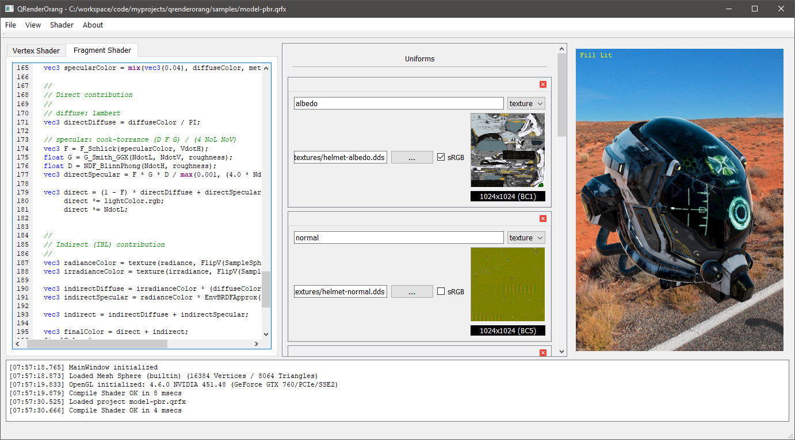

    ##############################################################################
    #                                                                            #
    #     ____    ____                 __          ____                          #
    #    / __ \  / __ \___  ____  ____/ /__  _____/ __ \_________ _____  ____ _  #
    #   / / / / / /_/ / _ \/ __ \/ __  / _ \/ ___/ / / / ___/ __ `/ __ \/ __ `/  #
    #  / /_/ / / _, _/  __/ / / / /_/ /  __/ /  / /_/ / /  / /_/ / / / / /_/ /   #
    #  \___\_\/_/ |_|\___/_/ /_/\__,_/\___/_/   \____/_/   \__,_/_/ /_/\__, /    #
    #                                                                 /____/     #
    #                                                                            #
    #                                                                            #
    #  (c) 2009 - Carlo Casta <carlo.casta@gmail.com>                            #
    #                                                                            #
    ##############################################################################

A toy IDE for GLSL shader authoring inspired by [AMD RenderMonkey](https://gpuopen.com/archive/gamescgi/rendermonkey-toolsuite/).

## REQUIREMENTS: ##
* Qt 5 [ http://www.qt.io ]
* GLM [http://glm.g-truc.net]
* GLEW [http://glew.sourceforge.net]
* tinyobjloader [https://github.com/syoyo/tinyobjloader]

(see ext/DEPS.txt for details)

## QUICK BUILDING: ##
* cd into the project source directory
* $ qmake
* $ make

## RUNNING: ##
* QRenderOrang executable should be inside bin/ directory
